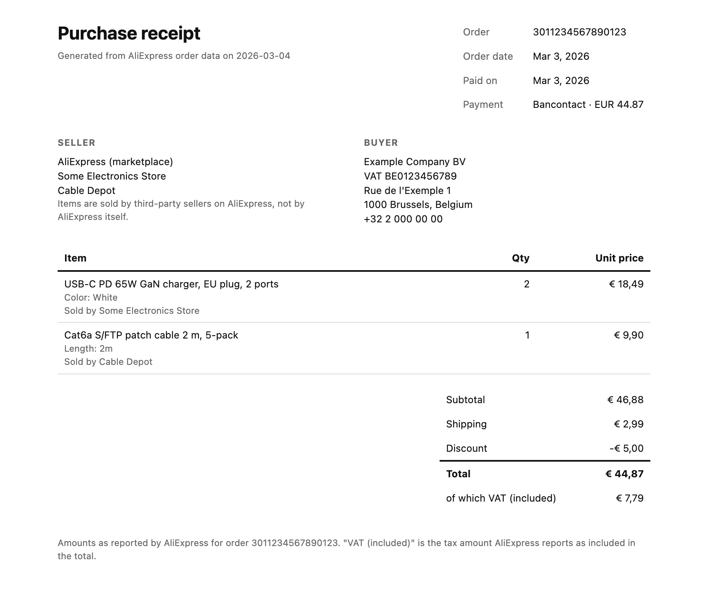
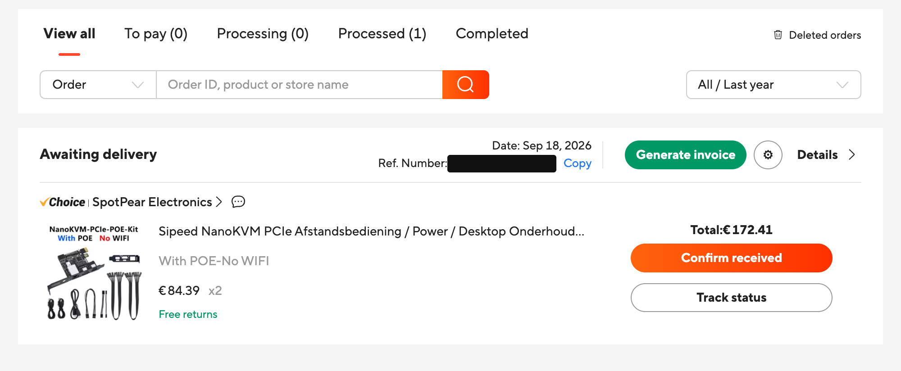
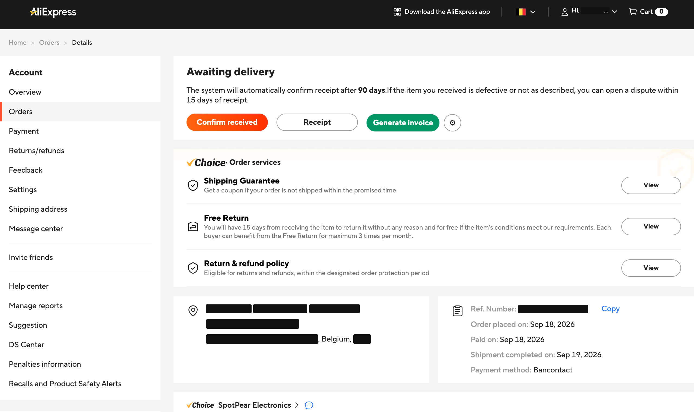
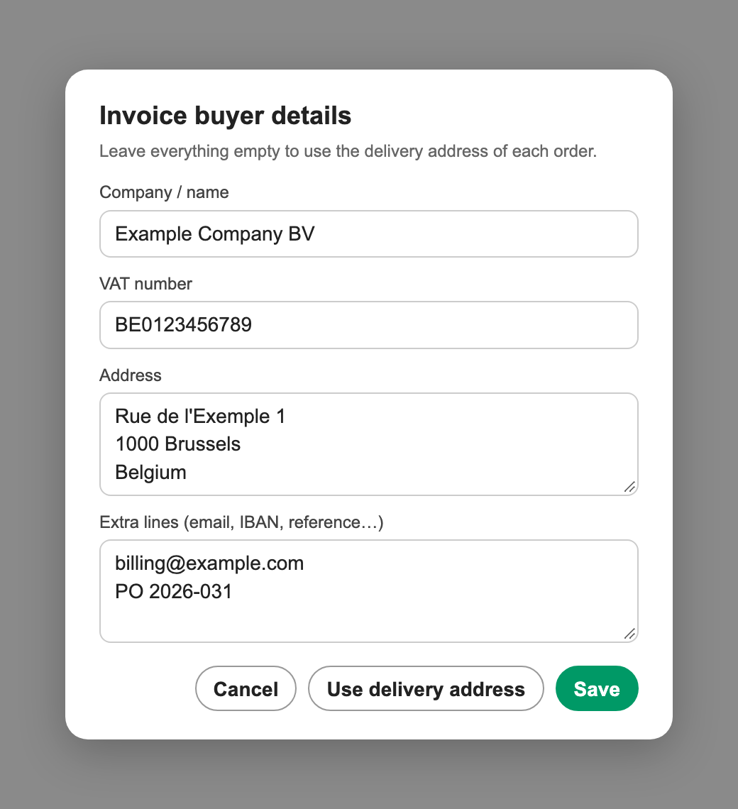

# AliExpress Invoice

[](https://raw.githubusercontent.com/elfensky/aliexpress-invoice/main/aliexpress-invoice.user.js)

Userscript that adds a **Generate invoice** button to your AliExpress orders and prints a proper purchase receipt to PDF: buyer block with VAT number, seller, items, every amount AliExpress reports, and the VAT amount included in the total.

AliExpress has a receipt page per order, but it drops the VAT line, has no buyer or seller block, and its Download button produces an image. This script uses the same order data and lays it out as a document an accountant accepts.



| Orders list | Order detail |
|---|---|
|  |  |



## Install

1. Install [Tampermonkey](https://www.tampermonkey.net/) (or Violentmonkey).
2. Click the **Install** button above; the extension opens its install screen.
3. Reload your AliExpress orders page.

Updates ship through the script's `@updateURL`, so installs stay current automatically.

## Use

- **Orders list** (`aliexpress.com/p/order/index.html`): each order card gets a **Generate invoice** button next to *Details*.
- **Order detail page**: the button sits next to AliExpress' own status buttons.
- Click it. The receipt opens in a new tab and the print dialog appears. Choose **Save as PDF**. The file is named `aliexpress-<orderId>.pdf`.
- The **⚙ gear** next to each button sets your own buyer block: company name, VAT number, address, and any extra lines (email, IBAN, reference). Leave it empty and the receipt uses the delivery address of each order, splitting a VAT number out of the contact name when one is present (`ACME BV BE0123456789` becomes a name and a VAT line).

Allow pop-ups for `aliexpress.com` if the receipt tab does not open.

## How it works

The order pages ship AliExpress' own request client (`lib.mtop`). The script calls `mtop.global.finance.taxation.invoice.queryOrderReceiptInfo` through it, so it never handles tokens or signatures itself. It renders the response as HTML with print CSS and calls `window.print()`. No dependencies, no build.

Only what AliExpress reports is shown. The document is a purchase receipt generated from order data, not an invoice issued by the seller.

## Development

```sh
node --test          # self-check of the pure parts (buyer parsing, rendering)
```

To try changes without reinstalling: paste the script into the DevTools console on an orders page. Set `AUTO_PRINT` to `false` first if you want to inspect the receipt tab without the print dialog.

## License

MIT
